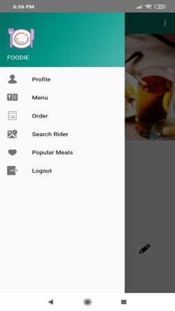
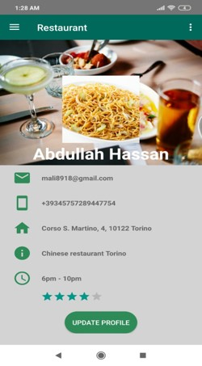
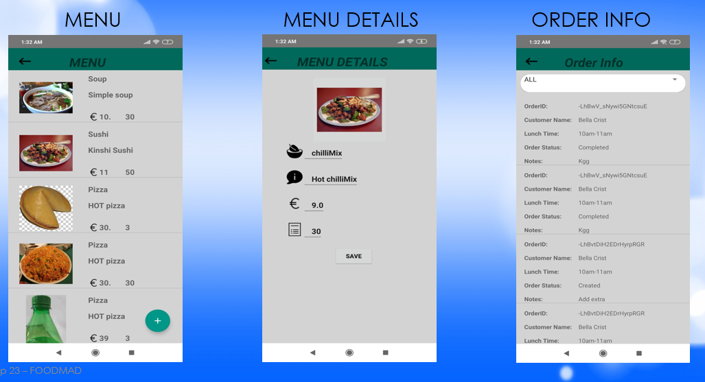

# RestaurantManager
This app is one module of a Food Delivery Project. This app recieves the notification from Customer Notify app, 
with the details of food items ordered by customer. 

Below are the screenshots of menu and profile page of delivery app:

                

 
Google Firebase Console was used to store the data. 
Below are other activity pages of Restaurant Manager app:

